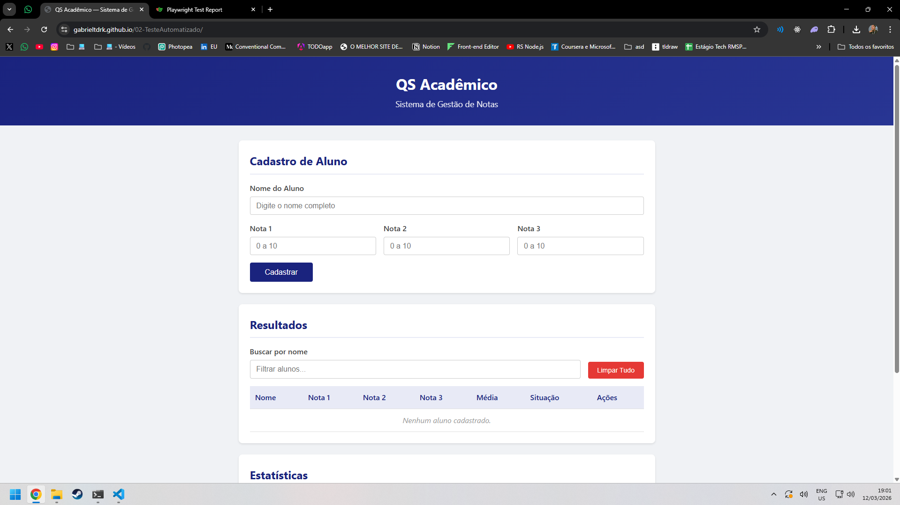
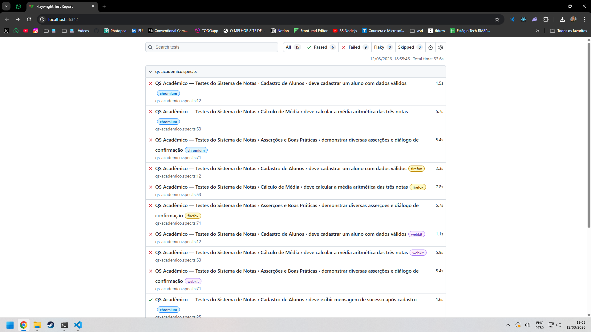
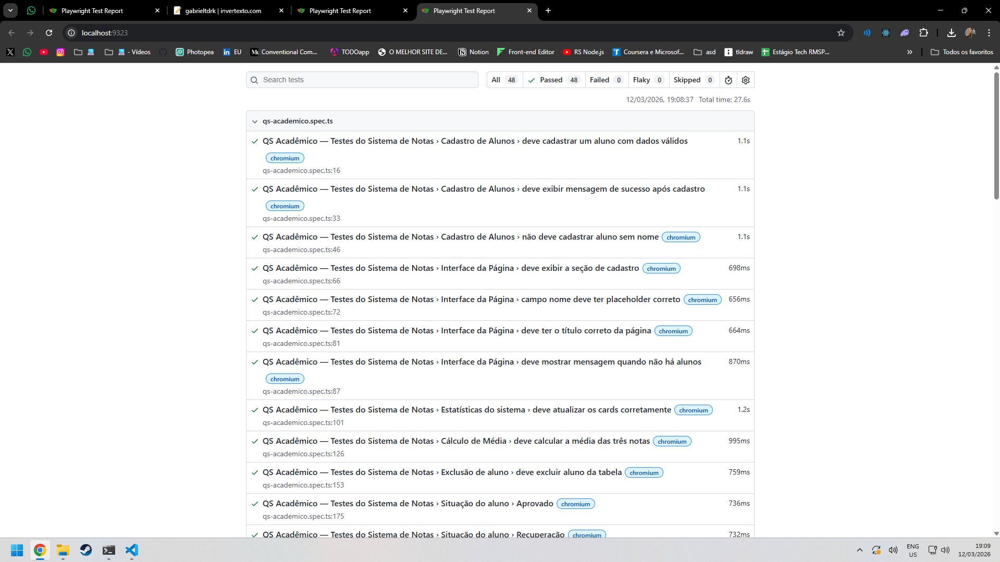

# Documento de Entregáveis — Automação de Testes com Playwright

**Aluno(a):** Gabriel Santana de Andrade
**Dupla (se aplicável):** Ana Beatriz Reis Malafatti
**Data:** 12/03/2026  
**Repositório (fork):** `https://github.com/gabrieltdrk/02-TesteAutomatizado`  
**GitHub Pages:** `https://gabrieltdrk.github.io/02-TesteAutomatizado/`

---

## Entregável 1 — Fork do Repositório e GitHub Pages

| Item | Valor |
|------|-------|
| **URL do fork no GitHub** | `https://github.com/gabrieltdrk/02-TesteAutomatizado` |
| **URL do site no GitHub Pages** | `https://gabrieltdrk.github.io/02-TesteAutomatizado/` |
| **Site está acessível e funcional?** | ✓ Sim / ☐ Não |

**Evidência:** _(inserir screenshot do site QS Acadêmico funcionando no GitHub Pages)_

---

## Entregável 2 — Projeto Playwright com Testes

### 2.1 Teste gerado pelo Codegen

| Item | Detalhes |
|------|----------|
| **Arquivo** | `testes-playwright/tests/qs-academico-codegen.spec.ts` |
| **Ações gravadas** | ✓ Cadastro de "Ana Silva" (8, 7, 9) |
|                     | ✓ Cadastro de "Carlos Lima" (5, 4, 6) |
|                     | ✓ Busca por "Ana" |
|                     | ✓ Exclusão do segundo aluno |
| **Teste executa com sucesso?** | ✓ Sim / ☐ Não |

**Reflexão sobre o Codegen:** _(Que tipo de seletores o Codegen utilizou? São os mais indicados? Justifique.)_

> _(escrever aqui)_

### 2.2 Testes escritos manualmente

| Item | Detalhes |
|------|----------|
| **Arquivo** | `testes-playwright/tests/qs-academico.spec.ts` |

**Checklist dos testes implementados:**

| # | Teste | Implementado | Passa? |
|---|-------|:------------:|:------:|
| 1 | Cadastrar aluno com dados válidos | ✓ | ✓ Sim / ☐ Não |
| 2 | Exibir mensagem de sucesso após cadastro | ✓ | ✓ Sim / ☐ Não |
| 3 | Rejeitar cadastro sem nome | ✓ | ✓ Sim / ☐ Não |
| 4 | Calcular a média aritmética das três notas | ✓ | ✓ Sim / ☐ Não |
| 5 | Validação de notas fora do intervalo (0–10) | ✓ | ✓ Sim / ☐ Não |
| 6 | Busca por nome (filtro) | ✓ | ✓ Sim / ☐ Não |
| 7 | Exclusão individual de aluno | ✓ | ✓ Sim / ☐ Não |
| 8 | Estatísticas (totais por situação) | ✓ | ✓ Sim / ☐ Não |
| 9 | Situação — Aprovado (média ≥ 7) | ✓ | ✓ Sim / ☐ Não |
| 10 | Situação — Reprovado (média < 5) | ✓ | ✓ Sim / ☐ Não |
| 11 | Situação — Recuperação (média ≥ 5 e < 7) | ✓ | ✓ Sim / ☐ Não |
| 12 | Múltiplos cadastros (3 alunos → 3 linhas) | ✓ | ✓ Sim / ☐ Não |

---

## Entregável 3 — Relatório HTML do Playwright

### 3.1 Relatório ANTES da correção do defeito

**Evidência:** _(inserir screenshot ou PDF do relatório HTML mostrando testes que passaram e falharam)_

| Métrica | Valor |
|---------|-------|
| **Total de testes** | 15 |
| **Testes aprovados (passed)** | 6 |
| **Testes reprovados (failed)** | 9 |
| **Navegadores testados** | 3 |

### 3.2 Relatório DEPOIS da correção do defeito

**Evidência:** _(inserir screenshot ou PDF do relatório HTML mostrando todos os testes passando)_

| Métrica | Valor |
|---------|-------|
| **Total de testes** | 48 |
| **Testes aprovados (passed)** | 48 |
| **Testes reprovados (failed)** | 0 |
| **Navegadores testados** | 3 |

---

## Entregável 4 — Registro do Defeito Encontrado

| Campo | Descrição |
|-------|-----------|
| **Título do defeito** | Cálculo da média ignora a terceira nota
| **Severidade** | ☐ Crítica / ✓ Alta / ☐ Média / ☐ Baixa |
| **Componente afetado** | função `calcularMedia` em `docs/js/app.js`
| **Passos para reproduzir** | 1. Acessar a aplicação no GitHub Pages |
|                            | 2. Preencher o nome do aluno (ex: "Pedro Santos") e três notas distintas (ex: Nota 1=8, Nota 2=6, Nota 3=10) |
|                            | 3. Clicar no botão "Cadastrar" |
|                            | 4. Observar o valor exibido na coluna "Média" da tabela — o valor exibido será 7.00 em vez do correto 8.00 |
| **Resultado esperado** | A média deve ser calculada como a média aritmética das **três** notas: (N1 + N2 + N3) / 3. Para N1=8, N2=6 e N3=10, o resultado esperado é **8.00** |
| **Resultado obtido** | A média é calculada usando apenas as duas primeiras notas: (N1 + N2) / 2, ignorando completamente a Nota 3. Para N1=8, N2=6 e N3=10, o resultado exibido é **7.00** |
| **Teste(s) que revelaram o defeito** | `Cálculo de Média > deve calcular a média das três notas` (`testes-playwright/tests/qs-academico.spec.ts`) |
| **Evidência visual** | _(inserir screenshot do teste falhando e/ou do Trace Viewer)_ |

### Análise do Trace Viewer

| Aspecto | Observação |
|---------|------------|
| **Em qual asserção o teste falhou?** | `expect(celulaMedia).toHaveText('8.00')` — asserção que verifica o valor da coluna Média |
| **Valor esperado** | `8.00` (média correta de 8, 6 e 10) |
| **Valor obtido** | `7.00` (média incorreta de apenas 8 e 6) |
| **Screenshot do momento da falha** | _(inserir)_ |

### Exemplo de cálculo demonstrando o defeito

| Notas inseridas | Média esperada (correta) | Média exibida (com defeito) | Diferença |
|:---------------:|:------------------------:|:---------------------------:|:---------:|
| N1=8, N2=6, N3=10 | 8.00 | 7.00 | -1.00 |
| N1=4, N2=6, N3=9  | 6.33 | 5.00 | -1.33 |
| N1=5, N2=7, N3=0  | 4.00 | 6.00 | +2.00 |

---

## Entregável 5 — Correção do Defeito

| Item | Detalhes |
|------|----------|
| **Arquivo corrigido** | `docs/js/app.js` |
| **Função corrigida** | `calcularMedia(nota1, nota2, nota3)` |
| **Código original (com defeito)** | `return (nota1 + nota2) / 2;` |
| **Código corrigido** | `return (nota1 + nota2 + nota3) / 3;` |
| **Hash do commit** | _(preencher após o commit)_ |
| **Mensagem do commit** | _(preencher após o commit)_ |

**Validação pós-correção:**

- ☐ Todos os testes passam após a correção
- ☐ O site no GitHub Pages foi atualizado (commit + push)
- ☐ O relatório HTML mostra 100% de aprovação

---

## Checklist Final de Entrega

| # | Entregável | Concluído |
|---|------------|:---------:|
| 1 | Fork do repositório + GitHub Pages funcionando | ☐ |
| 2 | Projeto Playwright com todos os testes (`qs-academico.spec.ts` e `qs-academico-codegen.spec.ts`) | ☐ |
| 3 | Screenshots/PDF do relatório HTML (antes e depois da correção) | ☐ |
| 4 | Registro do defeito encontrado (preenchido acima) | ☐ |
| 5 | Commit com a correção do defeito em `docs/js/app.js` | ☐ |
